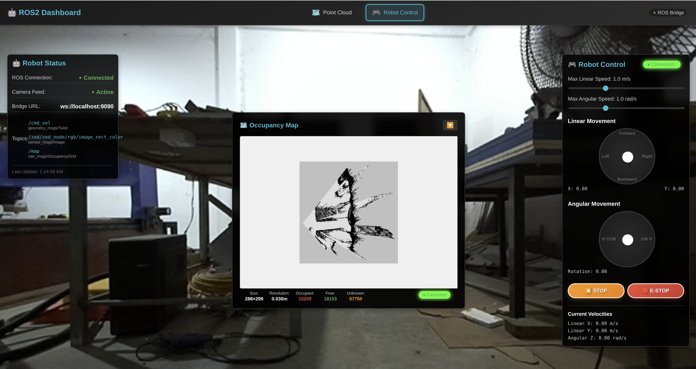
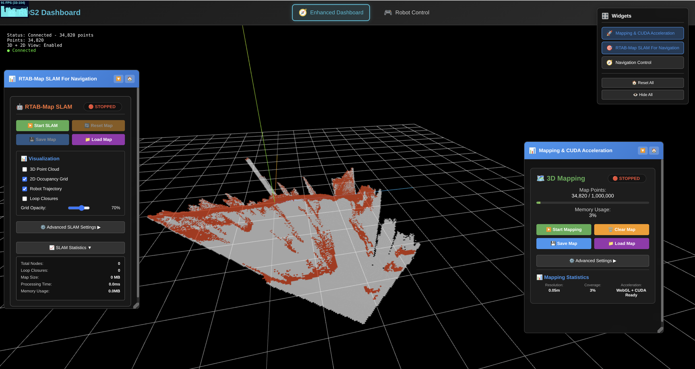
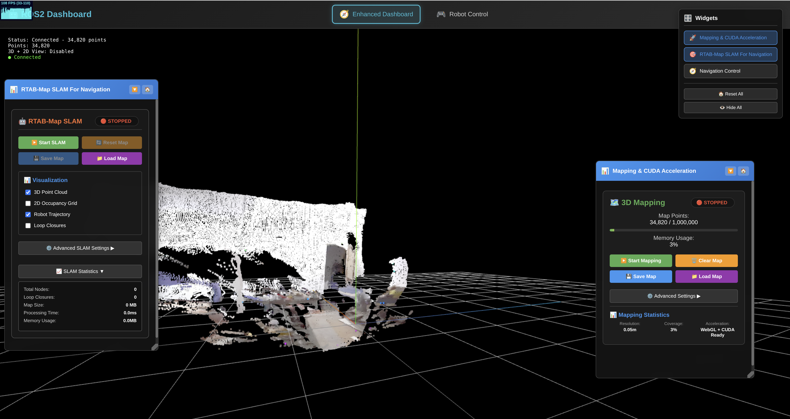
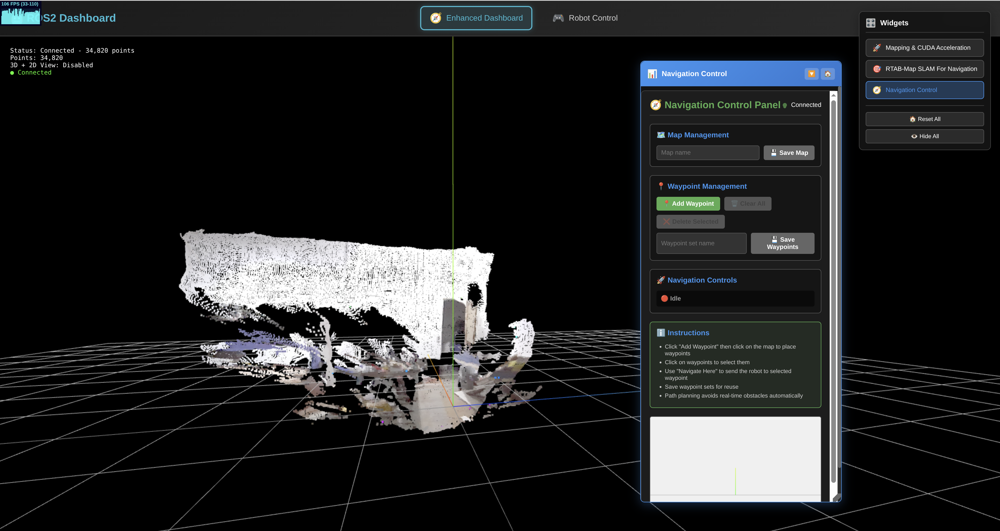
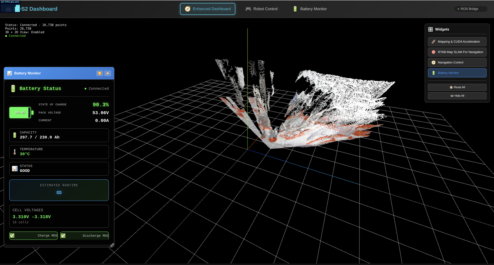

# Real-time Point Cloud Visualization Dashboard for ROS2

A comprehensive real-time 3D point cloud visualization dashboard built with React and Three.js for visualizing ZED camera data from ROS2. This web-based dashboard provides an interactive 3D view that matches RViz quality with enhanced colors and smooth real-time performance.


## 📸 Live Dashboard Screenshot









*Real-time 3D point cloud visualization showing 94K points from ZED camera with enhanced colors, interactive controls, and live statistics dashboard*

## 🎯 Overview

This dashboard provides real-time visualization of point cloud data from ZED cameras through ROS2, offering:

- **Real-time 3D Visualization**: Interactive web-based point cloud viewer
- **RViz-Quality Colors**: Enhanced brightness and realistic color rendering
- **High Performance**: Smooth rendering of 100K+ points at 10+ FPS
- **Interactive Controls**: Mouse-based rotation, panning, and zooming
- **WebSocket Integration**: Direct connection to ROS2 via rosbridge
- **Production Ready**: Clean, optimized code with error handling

## 🚀 Features

### 3D Web Visualization
- **Interactive 3D Environment**: Full mouse control for navigation
- **Real-time Rendering**: Live updates from ZED camera at 10 Hz
- **Enhanced Colors**: Bright, realistic colors matching RViz output
- **Optimized Performance**: Hardware-accelerated rendering with Three.js
- **Proper Orientation**: Anti-clockwise rotation around X-axis for correct viewing angle

### Smart Widget System
- **Draggable Widgets**: Modular, resizable, and collapsible widget panels
- **Battery Monitor**: Real-time battery status with enhanced visual indicators
- **RTAB-Map SLAM**: Advanced SLAM controls for navigation mapping
- **Mapping Controls**: CUDA-accelerated 3D mapping with voxel filtering
- **Navigation Panel**: Waypoint management and autonomous navigation
- **Widget Manager**: Toggle panel for easy widget management

### Battery Monitoring System ⚡
- **Real-time Battery Data**: Live SOC, voltage, current, and temperature monitoring
- **Visual Battery Indicator**: Realistic battery visualization with proper terminal alignment
- **Smart Status Icons**: Professional status indicators (📊, ⚡, 🔋, ✅, ⚠️, 🔌)
- **Health Color Coding**: Dynamic color changes based on battery health
- **Runtime Estimation**: Intelligent remaining runtime calculations
- **Cell Voltage Monitoring**: Individual cell voltage tracking and analysis
- **MOS Status**: Charge/discharge MOSFET status indicators
- **Compact Mode**: Space-efficient compact view option
- **Default Positioning**: Automatically positioned in left bottom corner

### Dashboard Interface
- **Live Statistics**: Real-time point count, connection status, and timestamps
- **Connection Management**: Auto-connect with manual disconnect option
- **Topic Information**: Display of ROS2 topic details and frame rates
- **Status Indicators**: Visual feedback for connection and data flow
- **Control Instructions**: Built-in help for user interactions
- **Widget Toggle Panel**: Easy enable/disable controls for all widgets

### Technical Features
- **Base64 Data Decoding**: Proper handling of rosbridge data encoding
- **Smart Color Processing**: RGB extraction with intelligent fallbacks
- **WebSocket Protocol**: Reliable real-time communication with ROS2
- **TypeScript Support**: Full type safety and modern development
- **Responsive Design**: Clean, modern UI with dark theme

## 🛠️ Technical Stack

- **Frontend**: React 17 + TypeScript
- **3D Rendering**: Three.js + @react-three/fiber + @react-three/drei
- **Build System**: Webpack 5 with hot reload
- **Communication**: WebSocket (rosbridge_suite)
- **Styling**: CSS3 with modern design
- **Development**: Node.js 12.22.9+ compatible

## 📋 Prerequisites

### ROS2 Environment
- ROS2 Humble (or compatible)
- ZED Camera SDK and ROS2 wrapper
- rosbridge_suite package

### Development Environment
- Node.js 12.22.9 or higher
- npm or yarn package manager
- Modern web browser with WebGL support

## 🔧 Installation

### Option 1: Automated Setup (Recommended)

Use the provided setup script for automatic installation and startup:

```bash
# Make script executable (if not already)
chmod +x setup_dashboard.sh

# Full setup and start (recommended for first time)
./setup_dashboard.sh

# Or skip installation if already done
./setup_dashboard.sh --skip-install

# Or just start services
./setup_dashboard.sh --start-only

# Get help
./setup_dashboard.sh --help
```

The script will:
- ✅ Check ROS2 and Node.js installation
- ✅ Install rosbridge_suite automatically
- ✅ Setup dashboard dependencies
- ✅ Start Zenoh RMW daemon (rmw_zenohd)
- ✅ Test CUDA acceleration (if available)
- ✅ Start all services and open dashboard

### Option 2: Manual Setup

### 1. Install ROS2 Dependencies

```bash
# Install rosbridge suite
sudo apt install ros-$ROS_DISTRO-rosbridge-suite

# Install ZED ROS2 wrapper (if not already installed)
# Follow ZED SDK installation guide for your system
```

### 2. Setup Dashboard

```bash
# Navigate to the dashboard directory
cd pointcloud-dashboard

# Install dependencies
npm install

# Start development server (runs on port 3002)
npm start
```

### 3. Start ROS2 Services

```bash
# Terminal 1: Start Zenoh RMW daemon
source /opt/ros/humble/setup.bash
ros2 run rmw_zenoh_cpp rmw_zenohd

# Terminal 2: Start ROS bridge
source /opt/ros/humble/setup.bash
ros2 launch rosbridge_server rosbridge_websocket_launch.xml

# Terminal 3: Start ZED camera (if needed)
source /opt/ros/humble/setup.bash
ros2 launch zed_wrapper zed_camera.launch.py camera_model:=zed2
```

## 🎮 Usage

### Accessing the Dashboard
1. Open your web browser
2. Navigate to `http://localhost:3002`
3. The dashboard will automatically connect to ROS bridge

### 3D Interaction Controls
- **Left Click + Drag**: Rotate the 3D view
- **Right Click + Drag**: Pan the view
- **Mouse Wheel**: Zoom in/out
- **Auto-rotation**: Disabled by default for user control

### Widget Management
- **Widget Toggle Panel**: Located in the top-right corner with 🎛️ icon
- **Enable/Disable Widgets**: Click widget buttons to toggle visibility
- **Drag & Drop**: Move widgets by dragging their title bars
- **Resize**: Drag widget corners to resize (when resizable)
- **Collapse**: Click collapse button to minimize widgets
- **Reset Positions**: Use "Reset All" button to restore default positions

### Battery Monitor Widget ⚡
- **Default Location**: Automatically positioned in left bottom corner
- **Real-time Data**: Live updates of SOC, voltage, current, temperature
- **Visual Indicators**: 
  - Battery outline with proper terminal alignment
  - Color-coded health status (green > 70%, yellow > 30%, red < 30%)
  - Professional status icons for different states
- **Runtime Estimation**: Intelligent calculation based on current consumption
- **Cell Monitoring**: Individual cell voltage tracking (when available)
- **Compact Mode**: Toggle between full and compact views

### Dashboard Features
- **Connection Status**: Green indicator when connected to ROS2
- **Point Count**: Live display of current point cloud size
- **Last Update**: Timestamp of most recent data
- **Topic Info**: Details about the subscribed ROS2 topic
- **Frame Rate**: Real-time performance metrics
- **Widget System**: Modular interface with draggable, resizable panels

## 🎨 3D Visualization Details

### Point Cloud Rendering
- **Point Size**: Optimized 0.025 units for clear visibility
- **Color Mapping**: 
  - Primary: RGB data from ZED camera
  - Fallback: Height-based color gradient (blue to red)
- **Brightness Enhancement**: 10% increase for vivid RViz-like appearance
- **Orientation**: -90° rotation around X-axis for proper viewing

### Performance Optimizations
- **BufferGeometry**: Efficient Three.js geometry for large point clouds
- **Hardware Acceleration**: WebGL-based rendering
- **Memory Management**: Optimized data structures for real-time updates
- **Tone Mapping**: Disabled for brighter, more accurate colors

### Visual Enhancements
- **Grid Helper**: Reference grid for spatial orientation
- **Axes Helper**: X, Y, Z axis indicators
- **Smooth Updates**: Interpolated transitions between frames
- **Anti-aliasing**: Smooth point rendering

## 📊 Performance Metrics

### Typical Performance
- **Point Count**: 100K - 120K points per frame
- **Update Rate**: 10 Hz from ZED camera
- **Render Rate**: 20+ FPS in browser
- **Latency**: <100ms end-to-end
- **Memory Usage**: ~50MB for dashboard

### Supported Point Cloud Sizes
- **Minimum**: 1K points
- **Typical**: 100K points
- **Maximum**: 500K+ points (performance dependent)

## 🔌 ROS2 Integration

### Comprehensive ROS Bridge Documentation
📖 **[Complete ROS Bridge Integration Guide](ROS_BRIDGE_INTEGRATION.md)**

This comprehensive documentation covers:
- **Point Cloud Topics**: 3D visualization data from ZED camera
- **Battery System Topics**: Real-time battery monitoring and health
- **Navigation Topics**: Waypoint navigation and path planning
- **SLAM/Mapping Topics**: RTAB-Map integration and occupancy grids
- **Camera Topics**: Live video feeds and image processing
- **Service Integration**: Map saving, topic discovery, and more
- **Data Type Reference**: Complete message structures and samples
- **Troubleshooting Guide**: Common issues and solutions

### Quick Reference - Primary Topics
- **Point Cloud**: `/zed/zed_node/point_cloud/cloud_registered` (`sensor_msgs/PointCloud2`)
- **Battery State**: `/battery/state` (`sensor_msgs/BatteryState`)
- **Navigation Goal**: `/move_base_simple/goal` (`geometry_msgs/PoseStamped`)
- **Occupancy Map**: `/map` (`nav_msgs/OccupancyGrid`)
- **Camera Feed**: `/zed/zed_node/rgb/image_rect_color` (`sensor_msgs/Image`)

### WebSocket Configuration
- **Default URL**: `ws://localhost:9090`
- **Protocol**: rosbridge WebSocket protocol v2.0
- **Auto-reconnect**: 3-second intervals
- **Connection Management**: Graceful handling of disconnections

## 🏗️ Architecture

### Component Structure
```
pointcloud-dashboard/
├── src/
│   ├── components/
│   │   ├── Dashboard.tsx          # Main dashboard UI
│   │   ├── PointCloudVisualization.tsx  # 3D rendering component
│   │   └── RosConnection.tsx      # WebSocket & data processing
│   ├── App.tsx                    # Main application
│   └── index.tsx                  # Entry point
├── public/
│   └── index.html                 # HTML template
├── package.json                   # Dependencies
├── tsconfig.json                  # TypeScript config
└── webpack.config.js              # Build configuration
```

### Data Flow
1. **ROS2 Publisher**: ZED camera publishes point cloud data
2. **rosbridge**: Converts ROS2 messages to WebSocket
3. **WebSocket Client**: Dashboard receives base64 encoded data
4. **Data Processing**: Decode and parse binary point cloud data
5. **3D Rendering**: Three.js renders points with colors
6. **User Interaction**: Mouse controls update camera view

## 🎛️ Configuration

### Environment Variables
```bash
# Optional: Custom ROS bridge URL
REACT_APP_ROS_BRIDGE_URL=ws://localhost:9090

# Optional: Point cloud topic
REACT_APP_POINT_CLOUD_TOPIC=/zed/zed_node/point_cloud/cloud_registered
```

### Customization Options
- **Point Size**: Modify in `PointCloudVisualization.tsx`
- **Colors**: Adjust brightness/saturation in `RosConnection.tsx`
- **Update Rate**: Configure in WebSocket subscription
- **Camera Position**: Set initial view in Three.js scene

## 🐛 Troubleshooting

### Common Issues

**Dashboard shows 0 points**
- Check if ZED camera is publishing data: `ros2 topic hz /zed/zed_node/point_cloud/cloud_registered`
- Verify rosbridge is running: `ros2 node list | grep rosbridge`
- Check browser console for WebSocket errors

**Black/missing colors**
- Ensure ZED camera is properly calibrated
- Check if RGB data is available in point cloud
- Fallback height-based coloring should activate automatically

**Performance issues**
- Reduce point cloud resolution in ZED configuration
- Check browser hardware acceleration is enabled
- Monitor system resources (CPU/GPU usage)

**Connection problems**
- Verify rosbridge is accessible: `telnet localhost 9090`
- Check firewall settings
- Ensure ROS2 environment is properly sourced

### Debug Mode
Enable debug logging by uncommenting debug lines in `RosConnection.tsx`:
```typescript
console.log(`Point ${i} RGB: raw=${rgbValue}, r=${r}, g=${g}, b=${b}`);
```

## 🚀 Deployment

### Development
```bash
npm start  # Starts development server on http://localhost:3002
```

### Production Build
```bash
npm run build  # Creates optimized production build
npm run serve  # Serves production build locally
```

### CUDA Acceleration (Optional)
For enhanced performance with NVIDIA GPUs:
```bash
# Test CUDA accelerator (falls back to CPU if CUDA unavailable)
python3 cuda_accelerator.py

# Install CUDA dependencies if needed
pip install cupy-cuda12x  # For CUDA 12.x
pip install numba
```

### Docker Deployment
```dockerfile
FROM node:16-alpine
WORKDIR /app
COPY package*.json ./
RUN npm install
COPY . .
RUN npm run build
EXPOSE 3002
CMD ["npm", "start"]
```

## 🤝 Contributing

1. Fork the repository
2. Create a feature branch: `git checkout -b feature/new-feature`
3. Commit changes: `git commit -am 'Add new feature'`
4. Push to branch: `git push origin feature/new-feature`
5. Submit a Pull Request

## 📄 License

This project is licensed under the MIT License - see the LICENSE file for details.

## 🙏 Acknowledgments

- **ZED SDK**: Stereolabs for ZED camera support
- **ROS2**: Open Robotics for the robotics framework
- **Three.js**: Three.js contributors for 3D rendering
- **React Three Fiber**: Poimandres for React Three.js integration

## 📞 Support

For issues and questions:
- Create an issue in the repository
- Check the troubleshooting section
- Review ROS2 and ZED documentation

---

**Built with ❤️ for the ROS2 and robotics community**
